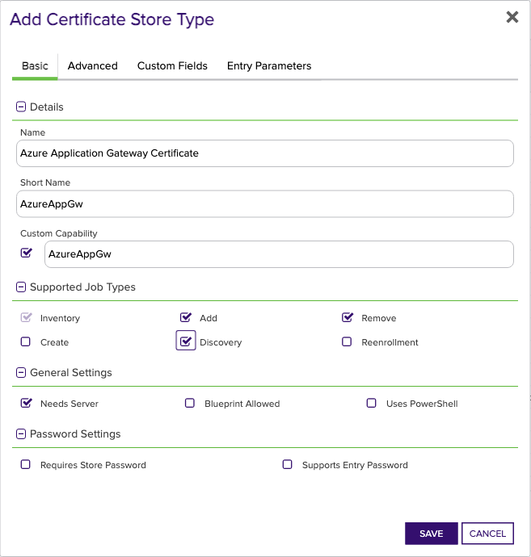
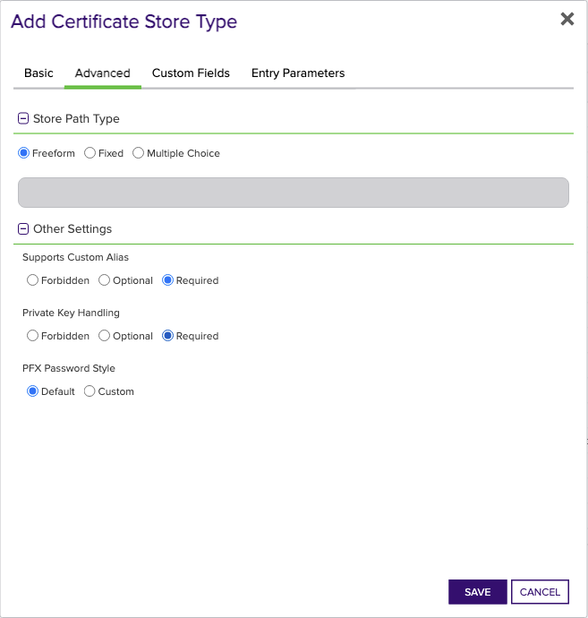
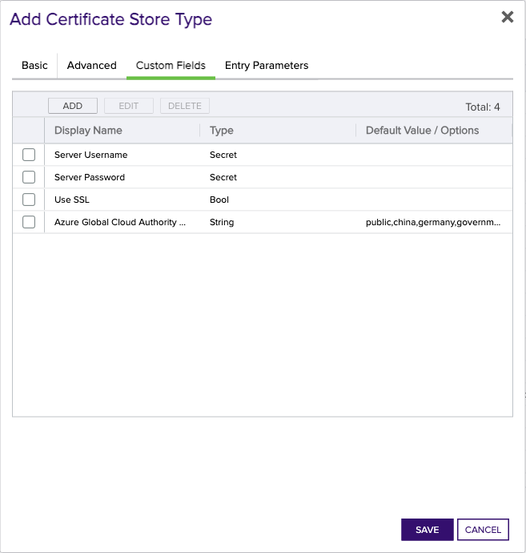
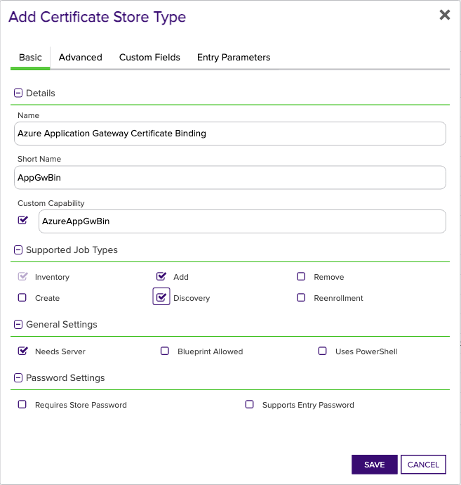
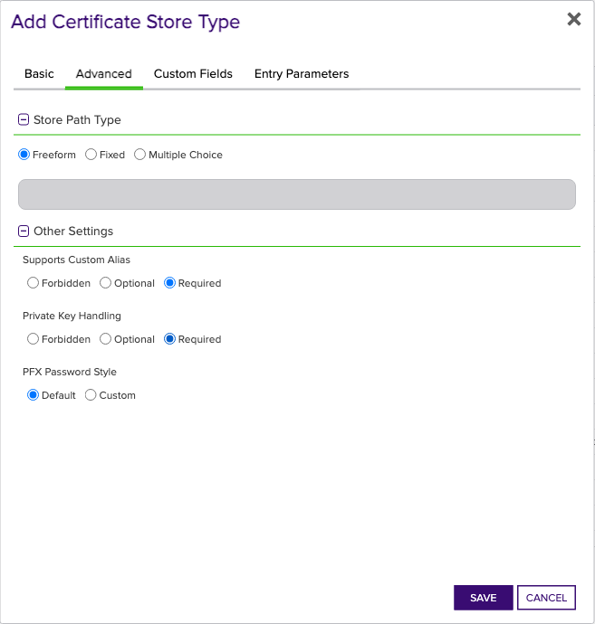

# Azure Application Gateway Orchestrator

The Azure Application Gateway Orchestrator Extension is an extension to the Keyfactor Universal Orchestrator that allows for the management of certificates on Azure Application Gateways, including the ability to add and bind certificates to HTTPS listeners.

#### Integration status: Production - Ready for use in production environments.

## About the Keyfactor Universal Orchestrator Extension

This repository contains a Universal Orchestrator Extension which is a plugin to the Keyfactor Universal Orchestrator. Within the Keyfactor Platform, Orchestrators are used to manage “certificate stores” &mdash; collections of certificates and roots of trust that are found within and used by various applications.

The Universal Orchestrator is part of the Keyfactor software distribution and is available via the Keyfactor customer portal. For general instructions on installing Extensions, see the “Keyfactor Command Orchestrator Installation and Configuration Guide” section of the Keyfactor documentation. For configuration details of this specific Extension see below in this readme.

The Universal Orchestrator is the successor to the Windows Orchestrator. This Orchestrator Extension plugin only works with the Universal Orchestrator and does not work with the Windows Orchestrator.

## Support for Azure Application Gateway Orchestrator

Azure Application Gateway Orchestrator is open source and supported on best effort level for this tool/library/client.  This means customers can report Bugs, Feature Requests, Documentation amendment or questions as well as requests for customer information required for setup that needs Keyfactor access to obtain. Such requests do not follow normal SLA commitments for response or resolution. If you have a support issue, please open a support ticket via the Keyfactor Support Portal at https://support.keyfactor.com/

###### To report a problem or suggest a new feature, use the **[Issues](../../issues)** tab. If you want to contribute actual bug fixes or proposed enhancements, use the **[Pull requests](../../pulls)** tab.

---


---


## Keyfactor Version Supported

The minimum version of the Keyfactor Universal Orchestrator Framework needed to run this version of the extension is 10.4
## Platform Specific Notes

The Keyfactor Universal Orchestrator may be installed on either Windows or Linux based platforms. The certificate operations supported by a capability may vary based what platform the capability is installed on. The table below indicates what capabilities are supported based on which platform the encompassing Universal Orchestrator is running.
| Operation | Win | Linux |
|-----|-----|------|
|Supports Management Add|&check; |&check; |
|Supports Management Remove|&check; |&check; |
|Supports Create Store|  |  |
|Supports Discovery|&check; |&check; |
|Supports Renrollment|  |  |
|Supports Inventory|&check; |&check; |


---


## Overview
The Azure Application Gateway Orchestrator extension remotely manages certificates used by Azure Application Gateways. The extension supports two different store types - one that generally manages certificates stored in the Application Gateway, and one that manages the bindings of Application Gateway certificates to HTTPS/TLS Listeners.

> The extension manages only App Gateway Certificates, _not_ Azure Key Vault certificates. Certificates imported from Azure Key Vault to Azure Application Gateways will be downloaded for certificate inventory purposes _only_. The Azure Application Gateway orchestrator extension will _not_ perform certificate management operations on Azure Key Vault secrets. If you need to manage certificates in Azure Key Vault, use the [Azure Key Vault Orchestrator](https://github.com/Keyfactor/azurekeyvault-orchestrator).
>
> If the certificate management capabilities of Azure Key Vault are desired over direct management of certificates in Application Gateways, the Azure Key Vault orchestrator can be used in conjunction with this extension for accurate certificate location reporting via the inventory job type. This management strategy requires manual binding of certificates imported to an Application Gateway from AKV and can result in broken state in the Azure Application Gateway in the case that the secret is deleted in AKV.

### Azure Application Gateway Certificate store type

The Azure Application Gateway Certificate store type, `AzureAppGw`, manages `ApplicationGatewaySslCertificate` objects owned by Azure Application Gateways. This store type collects inventory and manages all ApplicationGatewaySslCertificate objects associated with an Application Gateway. The store type is implemented primarily for Inventory and Management Remove operations, since the intended usage of ApplicationGatewaySslCertificates in Application Gateways is for serving TLS client traffic via TLS Listeners. Management Add and associated logic for certificate renewal is also supported for this certificate store type for completeness, but the primary intended functionality of this extension is implemented with the App Gateway Certificate Binding store type.

> If an ApplicationGatewaySslCertificate is bound to a TLS Listener at the time of a Management Remove operation, the operation will fail since at least one certificate must be bound at all times.

> If a renewal job is scheduled for an `AzureAppGw` certificate store, the extension will report a success and perform no action if the certificate being renewed is bound to a TLS Listener. This is because a certificate located in an `AzureAppGw` certificate store that is bound to a TLS Listener is logically the same as the same certificate located in an `AzureAppGwBin` store type. For this reason, it's expected that the certificate will be renewed and re-bound to the listener by the `AppGwBin` certificate operations.
>
> If the renewed certificate is not bound to a TLS Listener, the operation will be performed the same as any certificate renewal process that honors the Overwrite flag.

### Azure Application Gateway Certificate Binding store type

The Azure Application Gateway Certificate Binding store type, `AzureAppGwBin`, represents certificates bound to TLS Listeners on Azure App Gateways. The only supported operations on this store type are Management Add and Inventory. The Management Add operation for this store type creates and binds an ApplicationGatewaySslCertificate to a pre-existing TLS Listener on an Application Gateway. When the Add operation is configured in Keyfactor Command, the certificate Alias configures which TLS Listener the certificate will be bound to. If the HTTPS listener is already bound to a certificate with the same name, the Management Add operation will perform a replacement of the certificate, _**regardless of the existence of the Replace flag configured with renewal jobs**_. The replacement operation performs several API interactions with Azure since at least one certificate must be bound to a TLS listener at all times, and the name of ApplicationGatewaySslCertificates must be unique. For the sake of completeness, the following describes the mechanics of this replacement operation:
 
1. Determine the name of the certificate currently bound to the HTTPS listener - Alias in 100% of cases if the certificate was originally added by the App Gateway Orchestrator Extension, or something else if the certificate was added by some other means (IE, the Azure Portal, or some other API client).
2. Create and bind a temporary certificate to the HTTPS listener with the same name as the Alias.
3. Delete the AppGatewayCertificate previously bound to the HTTPS listener called Alias.
4. Recreate and bind an AppGatewayCertificate with the same name as the HTTPS listener called Alias. If the Alias is called `listener1`, the new certificate will be called `listener1`, regardless of the name of the certificate that was previously bound to the listener.
5. Delete the temporary certificate.

In the unlikely event that a failure occurs at any point in the replacement procedure, it's expected that the correct certificate will be served by the TLS Listener, since most of the mechanics are actually implemented to resolve the unique naming requirement. 

The Inventory job type for `AzureAppGwBin` reports only ApplicationGatewaySslCertificates that are bound to TLS Listeners. If the certificate was added with Keyfactor Command and this orchestrator extension, the name of the certificate in the Application Gateway will be the same as the TLS Listener. E.g., if the Alias configured in Command corresponds to a TLS Listener called `location-service-https-lstn1`, the certificate in the Application Gateway will also be called `location-service-https-lstn1`. However, if the certificate was added to the Application Gateway by other means (such as the Azure CLI, import from AKV, etc.), the Inventory job mechanics will still report the name of the TLS Listener in its report back to Command. 

### Discovery Job

Both `AzureAppGw` and `AzureAppGwBin` support the Discovery operation. The Discovery operation discovers all Azure Application Gateways in each resource group that the service principal has access to. The discovered Application Gateways are reported back to Command and can be easily added as certificate stores from the Locations tab.

The Discovery operation uses the "Directories to search" field, and accepts input in one of the following formats:
- `*` - If the asterisk symbol `*` is used, the extension will search for Application Gateways in every resource group that the service principal has access to, but only in the tenant that the discovery job was configured for as specified by the "Client Machine" field in the certificate store configuration.
- `<tenant-id>,<tenant-id>,...` - If a comma-separated list of tenant IDs is used, the extension will search for Application Gateways in every resource group and tenant specified in the list. The tenant IDs should be the GUIDs associated with each tenant, and it's the user's responsibility to ensure that the service principal has access to the specified tenants.

### Certificates Imported to Application Gateways from Azure Key Vault

Natively, Azure Application Gateways support integration with Azure Key Vault for secret/certificate management. This integration works by creating a TLS Listener certificate with a reference to a secret in Azure Key Vault (specifically, a URI in the format `https://<vault-name>.vault.azure.net/secrets/<secret-name>`), authenticated using a Managed Identity. If the Application Gateway orchestrator extension is deployed to manage App Gateways with certificates imported from Azure Key Vault, the following truth table represents the possible operations and their result, specifically with respect to AKV.

| Store Type   | Operation | Result                                                                                                                                                                                                                                                                                                                                                                                        |
|--------------|-----------|-----------------------------------------------------------------------------------------------------------------------------------------------------------------------------------------------------------------------------------------------------------------------------------------------------------------------------------------------------------------------------------------------|
| `AzureAppGw` | Inventory | Certificate is downloaded from Azure Key Vault and reported back to Keyfactor Command. In Keyfactor Command, the certificate will show as being located in the AzureAppGw certificate store [in addition to the AKV, if AKV orchestrator extension is also deployed].                                                                                                                         |
| `AzureAppGw` | Add       | The Add operation will not create secrets in AKV; it creates ApplicationGatewaySslCertificates.<br/> <br/>If an `AzureAppGw` Add operation is scheduled with the Replace flag, the _**link to the AKV certificate will be broken**_, and a native ApplicationGatewaySslCertificate will be created in its place - The secret in AKV will still exist.                                       |
| `AzureAppGw` | Remove    | The ApplicationGatewaySslCertificate is deleted from the Application Gateway, but the secret that the certificate referenced in AKV still exists.                                                                                                                                                                                                                                             |
| `AzureAppGwBin`   | Inventory | Certificate is downloaded from Azure Key Vault and reported back to Keyfactor Command. In Keyfactor Command, the certificate will show as present in both an `AzureAppGw` certificate store _and_ an `AppGwBin` certificate store [in addition to the AKV, if AKV orchestrator extension is also deployed].                                                                                   |
| `AzureAppGwBin`   | Add       | The Add operation will not create secrets in AKV; it creates ApplicationGatewaySslCertificates. <br/> <br/>If a certificate with the same name as the TLS Listener already exists, it will be _replaced_ by a new ApplicationGatewaySslCertificate. <br/> <br/>If the certificate being replaced was imported from AKV, this binding will be broken and the secret will still exist in AKV. |

#### Mechanics of the Azure Key Vault Download Operation for Inventory Jobs that report certificates imported from AKV

If an AzureApplicationSslCertificate references a secret in AKV (was imported to the App Gateway from AKV), the inventory job will create and use a `SecretClient` from the [`Azure.Security.KeyVault.Secrets.SecretClient` dotnet package](https://learn.microsoft.com/en-us/dotnet/api/azure.security.keyvault.secrets.secretclient?view=azure-dotnet). Authentication to AKV via this client is configured using the exact same `TokenCredential` provided by the [Azure Identity client library for .NET](https://learn.microsoft.com/en-us/dotnet/api/overview/azure/identity-readme?view=azure-dotnet). This means that the Service Principal described in the [Azure Configuration](#azure-configuration) section must also have appropriate permissions to read secrets from the AKV that the App Gateway is integrated with.

The secret referenced in the AzureApplicationSslCertificate will be accessed exactly as reported by Azure, regardless of whether it exists in AKV. Since the App Gateway orchestrator extension doesn't manage AKV secrets in any way, the client will _only log an error_ if the client is unsuccessful in downloading the secret for any reason. IE, if the request to AKV fails after five tries, the imported certificate will not be reported to Keyfactor Command in Inventory operations. This design choice was made based on the logical existance or non-existance of the link between AKV and the App Gateway. 

## Azure Configuration and Permissions

The Azure Application Gateway Orchestrator extension uses an [Azure Service Principal](https://learn.microsoft.com/en-us/entra/identity-platform/app-objects-and-service-principals?tabs=browser) for authentication. Follow [Microsoft's documentation](https://learn.microsoft.com/en-us/azure/purview/create-service-principal-azure) to create a service principal.

For quick start and non-production environments, a Role Assignment should be created on _each resource group_ that own Application Gateways desiring management that grants the created Application/Service Principal the [Contributor (Privileged administrator) Role](https://learn.microsoft.com/en-us/azure/role-based-access-control/built-in-roles#contributor). For production environments, a custom role should be created that grants the following permissions:

- `Microsoft.Resources/subscriptions/resourcegroups/read` - Read : Get Resource Group
- `Microsoft.Network/applicationGateways/read` - Read : Get Application Gateway
- `Microsoft.Network/applicationGateways/write` - Write : Create or Update Application Gateway
- `Microsoft.ManagedIdentity/userAssignedIdentities/assign/action` - Other : RBAC action for assigning an existing user assigned identity to a resource
- `Microsoft.Network/virtualNetworks/subnets/join/action` - Other : Joins a virtual network. Not Alertable.

> Note that even if the Service Principal has permission to perform the 'Microsoft.Network/applicationGateways/write' action over the scope of the required resource group, there may be other permissions that are required by the CreateOrUpdate operation depending on the complexity of the Application Gateway's configuration. As such, the list of permissions above should not be considered as comprehensive.

If the managed Application Gateway is integrated with Azure Key Vault per the discussion in the [Certificates Imported to Application Gateways from Azure Key Vault](#certificates-imported-to-application-gateways-from-azure-key-vault) section, an [Access policy must be created](https://learn.microsoft.com/en-us/azure/key-vault/general/assign-access-policy?tabs=azure-portal) that grants the Application/Service Principal the Get secret permission for the associated Azure Key Vault. 

## Creating Store Types for the Azure Application Gateway Orchestrator
To get started with the Azure Application Gateway Orchestrator Extension, you'll need to create 2 store types in Keyfactor Command. The recommended and supported way to create store types is using the `kfutil` command line tool. Install [Kfutil](https://github.com/Keyfactor/kfutil) if it is not already installed. Once installed, use `kfutil login` to log into the target Command environment.

Then, use the following commands to create the store types:


```shell
kfutil store-types create AzureAppGw
kfutil store-types create AppGwBin
```

It is not required to create all store types. Only create the store types that are needed for the integration.

If you prefer to create store types manually in the UI, navigate to your Command instance and follow the instructions below.
<details><summary>AzureAppGw</summary>

Create a store type called `AzureAppGw` with the attributes in the tables below:

### Basic Tab
| Attribute | Value | Description |
| --------- | ----- | ----- |
| Name | Azure Application Gateway Certificate | Display name for the store type (may be customized) |
| Short Name | AzureAppGw | Short display name for the store type |
| Capability | AzureAppGw | Store type name orchestrator will register with. Check the box to allow entry of value |
| Supported Job Types (check the box for each) | Add, Remove, Discovery, Inventory | Job types the extension supports |
| Needs Server | &check; | Determines if a target server name is required when creating store |
| Blueprint Allowed |  | Determines if store type may be included in an Orchestrator blueprint |
| Uses PowerShell |  | Determines if underlying implementation is PowerShell |
| Requires Store Password |  | Determines if a store password is required when configuring an individual store. |
| Supports Entry Password |  | Determines if an individual entry within a store can have a password. |


The Basic tab should look like this:



### Advanced Tab
| Attribute | Value | Description |
| --------- | ----- | ----- |
| Supports Custom Alias | Required | Determines if an individual entry within a store can have a custom Alias. |
| Private Key Handling | Required | This determines if Keyfactor can send the private key associated with a certificate to the store. Required because IIS certificates without private keys would be invalid. |
| PFX Password Style | Default | 'Default' - PFX password is randomly generated, 'Custom' - PFX password may be specified when the enrollment job is created (Requires the Allow Custom Password application setting to be enabled.) |


The Advanced tab should look like this:



### Custom Fields Tab
Custom fields operate at the certificate store level and are used to control how the orchestrator connects to the remote target server containing the certificate store to be managed. The following custom fields should be added to the store type:

| Name | Display Name | Type | Default Value/Options | Required | Description |
| ---- | ------------ | ---- | --------------------- | -------- | ----------- |
| ServerUsername | Server Username | Secret | None | &check; | Application ID of the service principal, representing the identity used for managing the Application Gateway. |
| ServerPassword | Server Password | Secret | None | &check; | Secret of the service principal that will be used to manage the Application Gateway. |
| ServerUseSsl | Use SSL | Bool | true |  | Indicates whether SSL usage is enabled for the connection. |
| AzureCloud | Azure Global Cloud Authority Host | MultipleChoice | public,china,germany,government |  | Specifies the Azure Cloud instance used by the organization. |


The Custom Fields tab should look like this:



</details>

<details><summary>AppGwBin</summary>

Create a store type called `AppGwBin` with the attributes in the tables below:

### Basic Tab
| Attribute | Value | Description |
| --------- | ----- | ----- |
| Name | Azure Application Gateway Certificate Binding | Display name for the store type (may be customized) |
| Short Name | AppGwBin | Short display name for the store type |
| Capability | AzureAppGwBin | Store type name orchestrator will register with. Check the box to allow entry of value |
| Supported Job Types (check the box for each) | Add, Discovery | Job types the extension supports |
| Needs Server | &check; | Determines if a target server name is required when creating store |
| Blueprint Allowed |  | Determines if store type may be included in an Orchestrator blueprint |
| Uses PowerShell |  | Determines if underlying implementation is PowerShell |
| Requires Store Password |  | Determines if a store password is required when configuring an individual store. |
| Supports Entry Password |  | Determines if an individual entry within a store can have a password. |


The Basic tab should look like this:



### Advanced Tab
| Attribute | Value | Description |
| --------- | ----- | ----- |
| Supports Custom Alias | Required | Determines if an individual entry within a store can have a custom Alias. |
| Private Key Handling | Required | This determines if Keyfactor can send the private key associated with a certificate to the store. Required because IIS certificates without private keys would be invalid. |
| PFX Password Style | Default | 'Default' - PFX password is randomly generated, 'Custom' - PFX password may be specified when the enrollment job is created (Requires the Allow Custom Password application setting to be enabled.) |


The Advanced tab should look like this:



### Custom Fields Tab
Custom fields operate at the certificate store level and are used to control how the orchestrator connects to the remote target server containing the certificate store to be managed. The following custom fields should be added to the store type:

| Name | Display Name | Type | Default Value/Options | Required | Description |
| ---- | ------------ | ---- | --------------------- | -------- | ----------- |
| ServerUsername | Server Username | Secret | None |  | Application ID of the service principal, representing the identity used for managing the Application Gateway. |
| ServerPassword | Server Password | Secret | None |  | Secret of the service principal that will be used to manage the Application Gateway. |
| ServerUseSsl | Use SSL | Bool | true | &check; | Indicates whether SSL usage is enabled for the connection. |
| AzureCloud | Azure Global Cloud Authority Host | MultipleChoice | public,china,germany,government |  | Specifies the Azure Cloud instance used by the organization. |


The Custom Fields tab should look like this:


</details>

## Instantiating New Azure Application Gateway Orchestrator Stores
Once the store types have been created, you can instantiate certificate stores for any of the 2 store types. This section describes how to instantiate a certificate store for each store type. Creating new certificate stores is how certificates in the remote platform are inventoried and managed by the orchestrator.
<details><summary>AzureAppGw</summary>

In Keyfactor Command, navigate to Certificate Stores from the Locations Menu. Click the Add button to create a new Certificate Store using the settings defined below.

| Attribute | Description |
| --------- | ----------- |
| Category | Select Azure Application Gateway Certificate  or the customized certificate store name from the previous step. |
| Container | Optional container to associate certificate store with. |
| Client Machine | The Azure Tenant ID of the service principal, representing the Tenant ID where the Application/Service Principal is managed. |
| Store Path | Azure resource ID of the application gateway, following the format: `/subscriptions/<subscription-id>/resourceGroups/<resource-group-name>/providers/Microsoft.Network/applicationGateways/<application-gateway-name>`. |
| Orchestrator | Select an approved orchestrator capable of managing AzureAppGw certificates. Specifically, one with the AzureAppGw capability. |
| Server Username | Application ID of the service principal, representing the identity used for managing the Application Gateway. |
| Server Password | Secret of the service principal that will be used to manage the Application Gateway. |
| Use SSL | Indicates whether SSL usage is enabled for the connection. |
| Azure Global Cloud Authority Host | Specifies the Azure Cloud instance used by the organization. |


</details>

<details><summary>AppGwBin</summary>

In Keyfactor Command, navigate to Certificate Stores from the Locations Menu. Click the Add button to create a new Certificate Store using the settings defined below.

| Attribute | Description |
| --------- | ----------- |
| Category | Select Azure Application Gateway Certificate Binding  or the customized certificate store name from the previous step. |
| Container | Optional container to associate certificate store with. |
| Client Machine | The Azure Tenant ID of the service principal, representing the Tenant ID where the Application/Service Principal is managed. |
| Store Path | Azure resource ID of the application gateway, following the format: `/subscriptions/<subscription-id>/resourceGroups/<resource-group-name>/providers/Microsoft.Network/applicationGateways/<application-gateway-name>`. |
| Orchestrator | Select an approved orchestrator capable of managing AppGwBin certificates. Specifically, one with the AzureAppGwBin capability. |
| Server Username | Application ID of the service principal, representing the identity used for managing the Application Gateway. |
| Server Password | Secret of the service principal that will be used to manage the Application Gateway. |
| Use SSL | Indicates whether SSL usage is enabled for the connection. |
| Azure Global Cloud Authority Host | Specifies the Azure Cloud instance used by the organization. |


</details>

