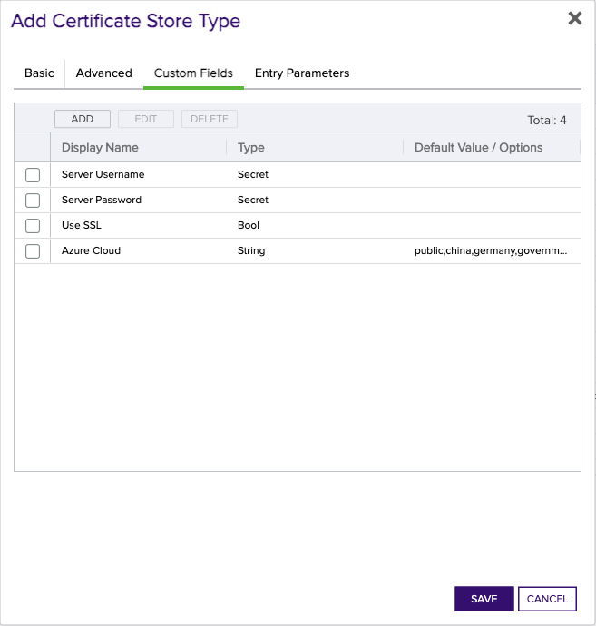
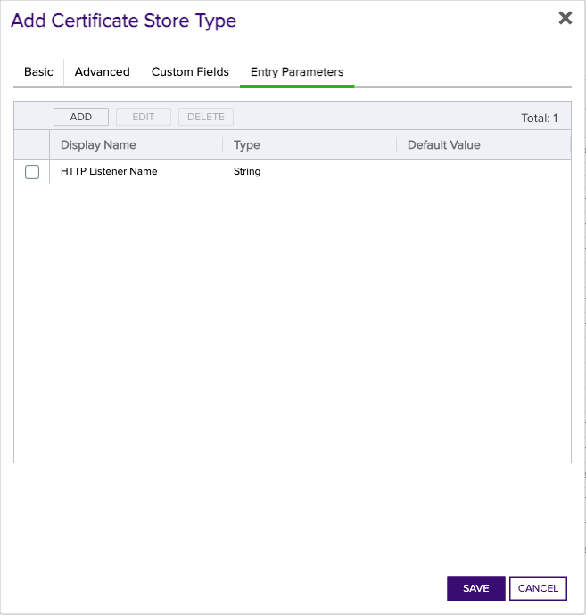

# Azure Application Gateway Orchestrator

The Azure Application Gateway Orchestrator extension acts as a proxy between Keyfactor and Azure that allows Keyfactor to manage Application Gateway certificates.

#### Integration status: Production - Ready for use in production environments.


## About the Keyfactor Universal Orchestrator Extension

This repository contains a Universal Orchestrator Extension which is a plugin to the Keyfactor Universal Orchestrator. Within the Keyfactor Platform, Orchestrators are used to manage “certificate stores” &mdash; collections of certificates and roots of trust that are found within and used by various applications.

The Universal Orchestrator is part of the Keyfactor software distribution and is available via the Keyfactor customer portal. For general instructions on installing Extensions, see the “Keyfactor Command Orchestrator Installation and Configuration Guide” section of the Keyfactor documentation. For configuration details of this specific Extension see below in this readme.

The Universal Orchestrator is the successor to the Windows Orchestrator. This Orchestrator Extension plugin only works with the Universal Orchestrator and does not work with the Windows Orchestrator.


## Support for Azure Application Gateway Orchestrator

Azure Application Gateway Orchestrator is open source and supported on best effort level for this tool/library/client.  This means customers can report Bugs, Feature Requests, Documentation amendment or questions as well as requests for customer information required for setup that needs Keyfactor access to obtain. Such requests do not follow normal SLA commitments for response or resolution. If you have a support issue, please open a support ticket via the Keyfactor Support Portal at https://support.keyfactor.com/

###### To report a problem or suggest a new feature, use the **[Issues](../../issues)** tab. If you want to contribute actual bug fixes or proposed enhancements, use the **[Pull requests](../../pulls)** tab.


---


## Keyfactor Version Supported

The minimum version of the Keyfactor Universal Orchestrator Framework needed to run this version of the extension is 10.1

## Platform Specific Notes

The Keyfactor Universal Orchestrator may be installed on either Windows or Linux based platforms. The certificate operations supported by a capability may vary based what platform the capability is installed on. The table below indicates what capabilities are supported based on which platform the encompassing Universal Orchestrator is running.
| Operation | Win | Linux |
|-----|-----|------|
|Supports Management Add|&check; |&check; |
|Supports Management Remove|&check; |&check; |
|Supports Create Store|  |  |
|Supports Discovery|&check; |&check; |
|Supports Renrollment|  |  |
|Supports Inventory|&check; |&check; |


---


## Overview
The Azure Application Gateway Orchestrator extension remotely manages certificates used by azure 
Application Gateways. The extension implements the Inventory, Management Add, Management Remove,
and Discovery job types. 

> The extension manages only App Gateway Certificates, _not_ Azure Key Vault certificates. The extension cannot inventory or manage certificates imported from Azure Key Vault. If you need to manage certificates in Azure Key Vault, use the [Azure Key Vault Orchestrator](https://github.com/Keyfactor/azurekeyvault-orchestrator).

The Add and Remove operations create and remove _ApplicationGatewaySslCertificate_'s associated with
the Application Gateway. The Add operation implements an optional enrollment field for an HTTP Listener name. If
provided, the certificate will be associated with the listener. If a certificate is associated with a listener,
the Remove operation assigns a default certificate to the listener before removal.

The Discovery operation discovers all Azure Application Gateways in each resource group that the service principal has access to.
The discovered Application Gateways are added to the discovered certificates in the Keyfactor platform and can be easily
added as certificate stores.

## Azure Configuration
The Azure Application Gateway Orchestrator extension uses an Azure Service Principal for authentication. Follow Microsoft's
[documentation](https://learn.microsoft.com/en-us/azure/purview/create-service-principal-azure) to create a service principal.
For quick start, the service principal should be granted the Contributor role on the resource group that manages the Application Gateway.
For production environments, the service principal should be granted the least privilege required to manage the Application Gateway.
Specifically, the service principal should be granted a role that enables Read and Write for `Microsoft.Network``

## Creating Store Types for the Azure Application Gateway Orchestrator
To get started with the Azure Application Gateway Orchestrator Extension, you'll need to create a store type in Keyfactor Command. The recommended and supported way to create store types is using the `kfutil` command line tool. Install [Kfutil](https://github.com/Keyfactor/kfutil) if it is not already installed. Once installed, use `kfutil login` to log into the target Command environment.

Then, use the following command to create the store types:


```shell
kfutil store-types create AzureAppGW
```

It is not required to create all store types. Only create the store types that are needed for the integration.

If you prefer to create store types manually in the UI, navigate to your Command instance and follow the instructions below.
<details><summary>AzureAppGW</summary>

Create a store type called `AzureAppGW` with the attributes in the tables below:

### Basic Tab
| Attribute | Value | Description |
| --------- | ----- | ----- |
| Name | Azure Application Gateway | Display name for the store type (may be customized) |
| Short Name | AzureAppGW | Short display name for the store type |
| Capability | AzureAppGW | Store type name orchestrator will register with. Check the box to allow entry of value |
| Supported Job Types (check the box for each) | Add, Discovery, Remove | Job types the extension supports |
| Needs Server | &check; | Determines if a target server name is required when creating store |
| Blueprint Allowed |  | Determines if store type may be included in an Orchestrator blueprint |
| Uses PowerShell |  | Determines if underlying implementation is PowerShell |
| Requires Store Password |  | Determines if a store password is required when configuring an individual store. |
| Supports Entry Password |  | Determines if an individual entry within a store can have a password. |


The Basic tab should look like this:


### Advanced Tab
| Attribute | Value | Description |
| --------- | ----- | ----- |
| Supports Custom Alias | Required | Determines if an individual entry within a store can have a custom Alias. |
| Private Key Handling | Required | This determines if Keyfactor can send the private key associated with a certificate to the store. Required because IIS certificates without private keys would be invalid. |
| PFX Password Style | Default | 'Default' - PFX password is randomly generated, 'Custom' - PFX password may be specified when the enrollment job is created (Requires the Allow Custom Password application setting to be enabled.) |


The Advanced tab should look like this:


### Custom Fields Tab
Custom fields operate at the certificate store level and are used to control how the orchestrator connects to the remote target server containing the certificate store to be managed. The following custom fields should be added to the store type:

| Name | Display Name | Type | Default Value/Options | Required | Description |
| ---- | ------------ | ---- | --------------------- | -------- | ----------- |
| ServerUsername | Server Username | Secret | None | &check; | Application ID of the service principal that will be used to manage the Application Gateway. |
| ServerPassword | Server Password | Secret | None | &check; | Secret of the service principal that will be used to manage the Application Gateway. |
| ServerUseSsl | Use SSL | Bool | true |  | Indicates whether SSL should be used |
| AzureCloud | Azure Cloud | MultipleChoice | public,china,germany,government |  | The Azure Cloud field, if necessary, should contain one of the following values: 'china, germany, government'. This field specifies the Azure Cloud instance used by the organization. If using the standard 'public' cloud, this field can be left blank or omitted from the store type definition. |


The Custom Fields tab should look like this:



### Entry Parameters Tab
Entry parameters are inventoried and maintained for each entry within a certificate store. They are typically used to support binding of a certificate to a resource. The following entry parameters should be added to the store type:


| Name | Display Name | Type | Default Value | Entry has a private key | Adding an entry | Removing an entry | Reenrolling an entry | Description |
| ---- | ------------ | ---- | ------------- | ----------------------- | ---------------- | ----------------- | ------------------- | ----------- |
| HTTPListenerName | HTTP Listener Name | String | None |  |  |  |  | The name of the HTTP listener to which the certificate will be bound. |


The Entry Parameters tab should look like this:



</details>

## Instantiating New Azure Application Gateway Orchestrator Stores
Once the store types have been created, you can instantiate certificate stores for the store type. This section describes how to instantiate a certificate store for each store type. Creating new certificate stores is how certificates in the remote platform are inventoried and managed by the orchestrator.
<details><summary>AzureAppGW</summary>

In Keyfactor Command, navigate to Certificate Stores from the Locations Menu. Click the Add button to create a new Certificate Store using the settings defined below.

| Attribute | Description |
| --------- | ----------- |
| Category | Select Azure Application Gateway  or the customized certificate store name from the previous step. |
| Container | Optional container to associate certificate store with. |
| Client Machine | The Azure Tenant ID of the service principal. |
| Store Path | Azure resource ID of the application gateway in the form `/subscriptions/<subscription-id>/resourceGroups/<resource-group-name>/providers/Microsoft.Network/applicationGateways/<application-gateway-name>` |
| Orchestrator | Select an approved orchestrator capable of managing AzureAppGW certificates. Specifically, one with the AzureAppGW capability. |
| Server Username | Application ID of the service principal that will be used to manage the Application Gateway. |
| Server Password | Secret of the service principal that will be used to manage the Application Gateway. |
| Use SSL | Indicates whether SSL should be used |
| Azure Cloud | The Azure Cloud field, if necessary, should contain one of the following values: 'china, germany, government'. This field specifies the Azure Cloud instance used by the organization. If using the standard 'public' cloud, this field can be left blank or omitted from the store type definition. |
| HTTP Listener Name | The name of the HTTP listener to which the certificate will be bound. |


</details>


### Important note about Certificate Renewal
The Azure Application Gateway Orchestrator extension supports certificate renewal. If a certificate is renewed and is associated with an HTTP Listener,
the extension will automatically re-associate the renewed certificate with the listener. The renewal workflow is as follows:
1. Create temporary `ApplicationGatewaySslCertificate` with the new certificate and private key
2. If the renewal certificate is associated with an HTTP Listener, assign the temporary certificate to the listener
3. Remove the original `ApplicationGatewaySslCertificate`
4. Create a new `ApplicationGatewaySslCertificate` with the original certificate's name and the new certificate and private key, and if applicable, assign it to the HTTP listener
5. Remove the temporary `ApplicationGatewaySslCertificate`

