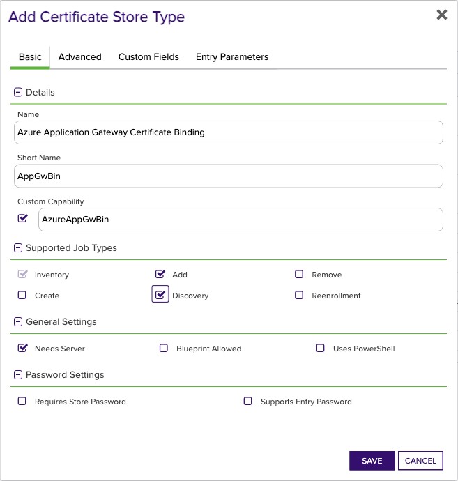
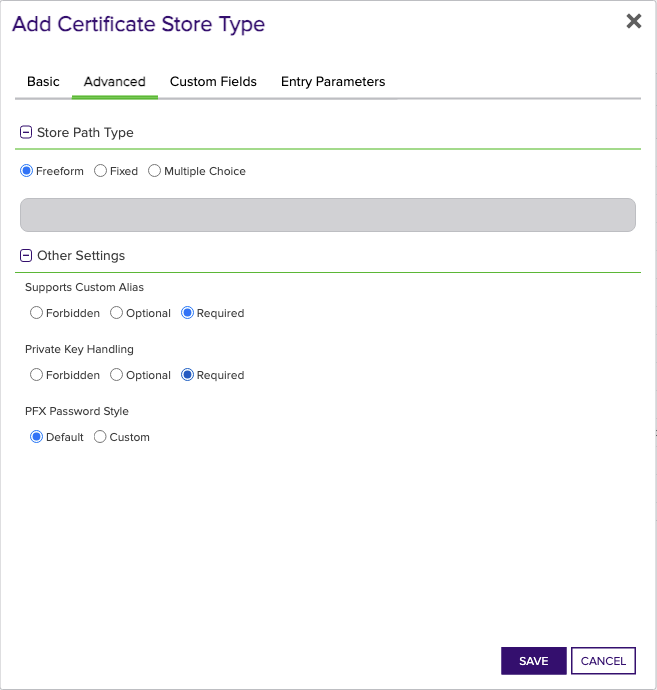
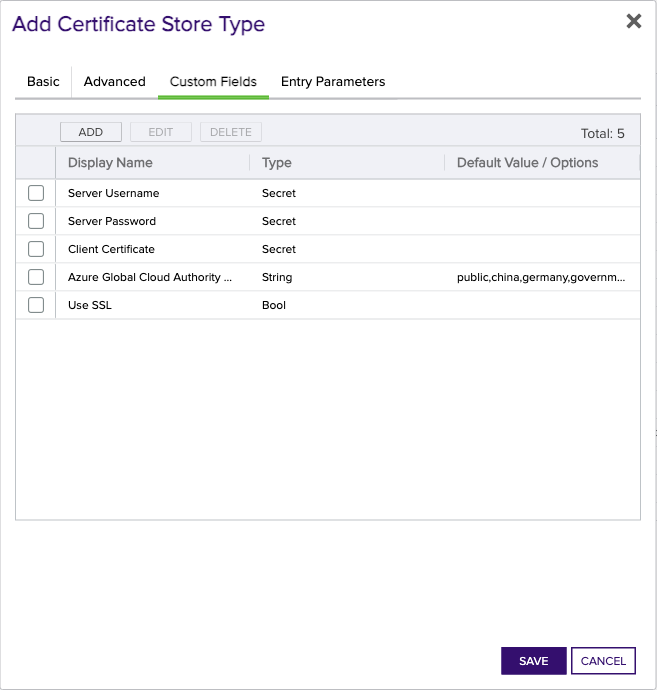

## Azure Application Gateway Certificate Binding

The Azure Application Gateway Certificate Binding store type, `AzureAppGwBin`, represents certificates bound to TLS Listeners on Azure App Gateways. The only supported operations on this store type are Management Add and Inventory. The Management Add operation for this store type creates and binds an ApplicationGatewaySslCertificate to a pre-existing TLS Listener on an Application Gateway. When the Add operation is configured in Keyfactor Command, the certificate Alias configures which TLS Listener the certificate will be bound to. If the HTTPS listener is already bound to a certificate with the same name, the Management Add operation will perform a replacement of the certificate, _**regardless of the existence of the Replace flag configured with renewal jobs**_. The replacement operation performs several API interactions with Azure since at least one certificate must be bound to a TLS listener at all times, and the name of ApplicationGatewaySslCertificates must be unique. For the sake of completeness, the following describes the mechanics of this replacement operation:
 
1. Determine the name of the certificate currently bound to the HTTPS listener - Alias in 100% of cases if the certificate was originally added by the App Gateway Orchestrator Extension, or something else if the certificate was added by some other means (IE, the Azure Portal, or some other API client).
2. Create and bind a temporary certificate to the HTTPS listener with the same name as the Alias.
3. Delete the AppGatewayCertificate previously bound to the HTTPS listener called Alias.
4. Recreate and bind an AppGatewayCertificate with the same name as the HTTPS listener called Alias. If the Alias is called `listener1`, the new certificate will be called `listener1`, regardless of the name of the certificate that was previously bound to the listener.
5. Delete the temporary certificate.

In the unlikely event that a failure occurs at any point in the replacement procedure, it's expected that the correct certificate will be served by the TLS Listener, since most of the mechanics are actually implemented to resolve the unique naming requirement. 

The Inventory job type for `AzureAppGwBin` reports only ApplicationGatewaySslCertificates that are bound to TLS Listeners. If the certificate was added with Keyfactor Command and this orchestrator extension, the name of the certificate in the Application Gateway will be the same as the TLS Listener. E.g., if the Alias configured in Command corresponds to a TLS Listener called `location-service-https-lstn1`, the certificate in the Application Gateway will also be called `location-service-https-lstn1`. However, if the certificate was added to the Application Gateway by other means (such as the Azure CLI, import from AKV, etc.), the Inventory job mechanics will still report the name of the TLS Listener in its report back to Command.


### Supported Job Types

| Job Name | Supported |
| -------- | --------- |
| Inventory | ✅ |
| Management Add | ✅ |
| Management Remove |  |
| Discovery | ✅ |
| Create |  |
| Reenrollment |  |

## Requirements

### Azure Service Principal (Azure Resource Manager Authentication)

The Azure Application Gateway Orchestrator extension uses an [Azure Service Principal](https://learn.microsoft.com/en-us/entra/identity-platform/app-objects-and-service-principals?tabs=browser) for authentication. Follow [Microsoft's documentation](https://learn.microsoft.com/en-us/entra/identity-platform/howto-create-service-principal-portal) to create a service principal.

#### Azure Application Gateway permissions

For quick start and non-production environments, a Role Assignment should be created on _each resource group_ that own Application Gateways desiring management that grants the created Application/Service Principal the [Contributor (Privileged administrator) Role](https://learn.microsoft.com/en-us/azure/role-based-access-control/built-in-roles#contributor). For production environments, a custom role should be created that grants the following permissions:

- `Microsoft.Resources/subscriptions/resourcegroups/read` - Read : Get Resource Group
- `Microsoft.Network/applicationGateways/read` - Read : Get Application Gateway
- `Microsoft.Network/applicationGateways/write` - Write : Create or Update Application Gateway
- `Microsoft.ManagedIdentity/userAssignedIdentities/assign/action` - Other : RBAC action for assigning an existing user assigned identity to a resource
- `Microsoft.Network/virtualNetworks/subnets/join/action` - Other : Joins a virtual network. Not Alertable.

> Note that even if the Service Principal has permission to perform the 'Microsoft.Network/applicationGateways/write' action over the scope of the required resource group, there may be other permissions that are required by the CreateOrUpdate operation depending on the complexity of the Application Gateway's configuration. As such, the list of permissions above should not be considered as comprehensive.

#### Azure Key Vault permissions

If the managed Application Gateway is integrated with Azure Key Vault per the discussion in the [Certificates Imported to Application Gateways from Azure Key Vault](#certificates-imported-to-application-gateways-from-azure-key-vault) section, perform one of the following actions for each Key Vault with certificates imported to App Gateways:
* **Azure role-based access control** - Create a Role Assignment that grants the Application/Service Principal the [Key Vault Secrets User](https://learn.microsoft.com/en-us/azure/key-vault/general/rbac-guide?tabs=azure-cli) built-in role.
* **Vault access policy** - [Create an Access Policy](https://learn.microsoft.com/en-us/azure/key-vault/general/assign-access-policy?tabs=azure-portal) that grants the Application/Service Principal the Get secret permission for each Azure Key Vault.

#### Client Certificate or Client Secret

Beginning in version 3.0.0, the Azure Application Gateway Orchestrator extension supports both [client certificate authentication](https://learn.microsoft.com/en-us/graph/auth-register-app-v2#option-1-add-a-certificate) and [client secret](https://learn.microsoft.com/en-us/graph/auth-register-app-v2#option-2-add-a-client-secret) authentication.

* **Client Secret** - Follow [Microsoft's documentation](https://learn.microsoft.com/en-us/graph/auth-register-app-v2#option-2-add-a-client-secret) to create a Client Secret. This secret will be used as the **Server Password** field in the [Certificate Store Configuration](#certificate-store-configuration) section.
* **Client Certificate** - Create a client certificate key pair with the Client Authentication extended key usage. The client certificate will be used in the ClientCertificate field in the [Certificate Store Configuration](#certificate-store-configuration) section. If you have access to Keyfactor Command, the instructions in this section walk you through enrolling a certificate and ensuring that it's in the correct format. Once enrolled, follow [Microsoft's documentation](https://learn.microsoft.com/en-us/graph/auth-register-app-v2#option-1-add-a-certificate) to add the _public key_ certificate (no private key) to the service principal used for authentication.

    The certificate can be in either of the following formats:
    * Base64-encoded PKCS#12 (PFX) with a matching private key.
    * Base64-encoded PEM-encoded certificate _and_ PEM-encoded PKCS8 private key. Make sure that the certificate and private key are separated with a newline. The order doesn't matter - the extension will determine which is which.

    If the private key is encrypted, the encryption password will replace the **Server Password** field in the [Certificate Store Configuration](#certificate-store-configuration) section.

> **Creating and Formatting a Client Certificate using Keyfactor Command**
>
> To get started quickly, you can follow the instructions below to create and properly format a client certificate to authenticate to the Microsoft Graph API.
>
> 1. In Keyfactor Command, hover over **Enrollment** and select **PFX Enrollment**.
> 2. Select a **Template** that supports Client Authentication as an extended key usage.
> 3. Populate the certificate subject as appropriate for the Template. It may be sufficient to only populate the Common Name, but consult your IT policy to ensure that this certificate is compliant.
> 4. At the bottom of the page, uncheck the box for **Include Chain**, and select either **PFX** or **PEM** as the certificate Format.
> 5. Make a note of the password on the next page - it won't be shown again.
> 6. Prepare the certificate and private key for Azure and the Orchestrator extension:
>     * If you downloaded the certificate in PEM format, use the commands below:
>
>        ```shell
>        # Verify that the certificate downloaded from Command contains the certificate and private key. They should be in the same file
>        cat <your_certificate.pem>
>
>        # Separate the certificate from the private key
>        openssl x509 -in <your_certificate.pem> -out pubkeycert.pem
>
>        # Base64 encode the certificate and private key
>        cat <your_certificate.pem> | base64 > clientcertkeypair.pem.base64
>        ```
>
>    * If you downloaded the certificate in PFX format, use the commands below:
>
>        ```shell
>        # Export the certificate from the PFX file
>        openssl pkcs12 -in <your_certificate.pfx> -clcerts -nokeys -out pubkeycert.pem
>
>        # Base64 encode the PFX file
>        cat <your_certificate.pfx> | base64 > clientcert.pfx.base64
>        ```
> 7. Follow [Microsoft's documentation](https://learn.microsoft.com/en-us/graph/auth-register-app-v2#option-1-add-a-certificate) to add the public key certificate to the service principal used for authentication.
>
> You will use `clientcert.[pem|pfx].base64` as the **ClientCertificate** field in the [Certificate Store Configuration](#certificate-store-configuration) section.


## Extension Mechanics

### Discovery Job

The Discovery operation discovers all Azure Application Gateways in each resource group that the service principal has access to. The discovered Application Gateways are reported back to Command and can be easily added as certificate stores from the Locations tab.

The Discovery operation uses the "Directories to search" field, and accepts input in one of the following formats:
- `*` - If the asterisk symbol `*` is used, the extension will search for Application Gateways in every resource group that the service principal has access to, but only in the tenant that the discovery job was configured for as specified by the "Client Machine" field in the certificate store configuration.
- `<tenant-id>,<tenant-id>,...` - If a comma-separated list of tenant IDs is used, the extension will search for Application Gateways in every resource group and tenant specified in the list. The tenant IDs should be the GUIDs associated with each tenant, and it's the user's responsibility to ensure that the service principal has access to the specified tenants.

> The Discovery Job only supports Client Secret authentication.

### Certificates Imported to Application Gateways from Azure Key Vault

Natively, Azure Application Gateways support integration with Azure Key Vault for secret/certificate management. This integration works by creating a TLS Listener certificate with a reference to a secret in Azure Key Vault (specifically, a URI in the format `https://<vault-name>.vault.azure.net/secrets/<secret-name>`), authenticated using a Managed Identity. If the Application Gateway orchestrator extension is deployed to manage App Gateways with certificates imported from Azure Key Vault, the following truth table represents the possible operations and their result, specifically with respect to AKV.

| Store Type   | Operation | Result                                                                                                                                                                                                                                                                                                                                                                                        |
|--------------|-----------|-----------------------------------------------------------------------------------------------------------------------------------------------------------------------------------------------------------------------------------------------------------------------------------------------------------------------------------------------------------------------------------------------|
| `AzureAppGw` | Inventory | Certificate is downloaded from Azure Key Vault and reported back to Keyfactor Command. In Keyfactor Command, the certificate will show as being located in the AzureAppGw certificate store [in addition to the AKV, if AKV orchestrator extension is also deployed].                                                                                                                         |
| `AzureAppGw` | Add       | The Add operation will not create secrets in AKV; it creates ApplicationGatewaySslCertificates.<br/> <br/>If an `AzureAppGw` Add operation is scheduled with the Replace flag, the _**link to the AKV certificate will be broken**_, and a native ApplicationGatewaySslCertificate will be created in its place - The secret in AKV will still exist.                                       |
| `AzureAppGw` | Remove    | The ApplicationGatewaySslCertificate is deleted from the Application Gateway, but the secret that the certificate referenced in AKV still exists.                                                                                                                                                                                                                                             |
| `AzureAppGwBin`   | Inventory | Certificate is downloaded from Azure Key Vault and reported back to Keyfactor Command. In Keyfactor Command, the certificate will show as present in both an `AzureAppGw` certificate store _and_ an `AppGwBin` certificate store [in addition to the AKV, if AKV orchestrator extension is also deployed].                                                                                   |
| `AzureAppGwBin`   | Add       | The Add operation will not create secrets in AKV; it creates ApplicationGatewaySslCertificates. <br/> <br/>If a certificate with the same name as the TLS Listener already exists, it will be _replaced_ by a new ApplicationGatewaySslCertificate. <br/> <br/>If the certificate being replaced was imported from AKV, this binding will be broken and the secret will still exist in AKV. |

#### Mechanics of the Azure Key Vault Download Operation for Inventory Jobs that report certificates imported from AKV

If an AzureApplicationSslCertificate references a secret in AKV (was imported to the App Gateway from AKV), the inventory job will create and use a `SecretClient` from the [`Azure.Security.KeyVault.Secrets.SecretClient` dotnet package](https://learn.microsoft.com/en-us/dotnet/api/azure.security.keyvault.secrets.secretclient?view=azure-dotnet). Authentication to AKV via this client is configured using the exact same `TokenCredential` provided by the [Azure Identity client library for .NET](https://learn.microsoft.com/en-us/dotnet/api/overview/azure/identity-readme?view=azure-dotnet). This means that the Service Principal described in the [Azure Configuration](#azure-configuration) section must also have appropriate permissions to read secrets from the AKV that the App Gateway is integrated with. The secret referenced in the AzureApplicationSslCertificate will be accessed exactly as reported by Azure, regardless of whether it exists in AKV.


## Certificate Store Type Configuration

The recommended method for creating the `AppGwBin` Certificate Store Type is to use [kfutil](https://github.com/Keyfactor/kfutil). After installing, use the following command to create the `` Certificate Store Type:

```shell
kfutil store-types create AppGwBin
```

<details><summary>AppGwBin</summary>

Create a store type called `AppGwBin` with the attributes in the tables below:

### Basic Tab
| Attribute | Value | Description |
| --------- | ----- | ----- |
| Name | Azure Application Gateway Certificate Binding | Display name for the store type (may be customized) |
| Short Name | AppGwBin | Short display name for the store type |
| Capability | AzureAppGwBin | Store type name orchestrator will register with. Check the box to allow entry of value |
| Supported Job Types (check the box for each) | Add, Discovery, Remove | Job types the extension supports |
| Supports Add | ✅ | Check the box. Indicates that the Store Type supports Management Add |
| Supports Remove |  |  Indicates that the Store Type supports Management Remove |
| Supports Discovery | ✅ | Check the box. Indicates that the Store Type supports Discovery |
| Supports Reenrollment |  |  Indicates that the Store Type supports Reenrollment |
| Supports Create |  |  Indicates that the Store Type supports store creation |
| Needs Server | ✅ | Determines if a target server name is required when creating store |
| Blueprint Allowed |  | Determines if store type may be included in an Orchestrator blueprint |
| Uses PowerShell |  | Determines if underlying implementation is PowerShell |
| Requires Store Password |  | Determines if a store password is required when configuring an individual store. |
| Supports Entry Password |  | Determines if an individual entry within a store can have a password. |

The Basic tab should look like this:



### Advanced Tab
| Attribute | Value | Description |
| --------- | ----- | ----- |
| Supports Custom Alias | Required | Determines if an individual entry within a store can have a custom Alias. |
| Private Key Handling | Required | This determines if Keyfactor can send the private key associated with a certificate to the store. Required because IIS certificates without private keys would be invalid. |
| PFX Password Style | Default | 'Default' - PFX password is randomly generated, 'Custom' - PFX password may be specified when the enrollment job is created (Requires the Allow Custom Password application setting to be enabled.) |

The Advanced tab should look like this:



### Custom Fields Tab
Custom fields operate at the certificate store level and are used to control how the orchestrator connects to the remote target server containing the certificate store to be managed. The following custom fields should be added to the store type:

| Name | Display Name | Type | Default Value/Options | Required | Description |
| ---- | ------------ | ---- | --------------------- | -------- | ----------- |
| ServerUsername | Server Username | Secret |  |  | Application ID of the service principal, representing the identity used for managing the Application Gateway. |
| ServerPassword | Server Password | Secret |  |  | A Client Secret that the extension will use to authenticate with the Azure Resource Management API for managing Application Gateway certificates, OR the password that encrypts the private key in ClientCertificate |
| ClientCertificate | Client Certificate | Secret |  |  | The client certificate used to authenticate with Azure Resource Management API for managing Application Gateway certificates. See the [requirements](#client-certificate-or-client-secret) for more information. |
| AzureCloud | Azure Global Cloud Authority Host | MultipleChoice | public,china,germany,government |  | Specifies the Azure Cloud instance used by the organization. |
| ServerUseSsl | Use SSL | Bool | true | ✅ | Specifies whether SSL should be used for communication with the server. Set to 'true' to enable SSL, and 'false' to disable it. |


The Custom Fields tab should look like this:




</details>

## Certificate Store Configuration

After creating the `AppGwBin` Certificate Store Type and installing the Azure Application Gateway Universal Orchestrator extension, you can create new [Certificate Stores](https://software.keyfactor.com/Core-OnPrem/Current/Content/ReferenceGuide/Certificate%20Stores.htm?Highlight=certificate%20store) to manage certificates in the remote platform.

The following table describes the required and optional fields for the `AppGwBin` certificate store type.

| Attribute | Description |
| --------- | ----------- |
| Category | Select "Azure Application Gateway Certificate Binding" or the customized certificate store name from the previous step. |
| Container | Optional container to associate certificate store with. |
| Client Machine | The Azure Tenant (directory) ID that owns the Service Principal. |
| Store Path | Azure resource ID of the application gateway, following the format: /subscriptions/<subscription-id>/resourceGroups/<resource-group-name>/providers/Microsoft.Network/applicationGateways/<application-gateway-name>. |
| Orchestrator | Select an approved orchestrator capable of managing `AppGwBin` certificates. Specifically, one with the `AzureAppGwBin` capability. |
| ServerUsername | Application ID of the service principal, representing the identity used for managing the Application Gateway. |
| ServerPassword | A Client Secret that the extension will use to authenticate with the Azure Resource Management API for managing Application Gateway certificates, OR the password that encrypts the private key in ClientCertificate |
| ClientCertificate | The client certificate used to authenticate with Azure Resource Management API for managing Application Gateway certificates. See the [requirements](#client-certificate-or-client-secret) for more information. |
| AzureCloud | Specifies the Azure Cloud instance used by the organization. |
| ServerUseSsl | Specifies whether SSL should be used for communication with the server. Set to 'true' to enable SSL, and 'false' to disable it. |

* **Using kfutil**

    ```shell
    # Generate a CSV template for the AzureApp certificate store
    kfutil stores import generate-template --store-type-name AppGwBin --outpath AppGwBin.csv

    # Open the CSV file and fill in the required fields for each certificate store.

    # Import the CSV file to create the certificate stores
    kfutil stores import csv --store-type-name AppGwBin --file AppGwBin.csv
    ```

* **Manually with the Command UI**: In Keyfactor Command, navigate to Certificate Stores from the Locations Menu. Click the Add button to create a new Certificate Store using the attributes in the table above.