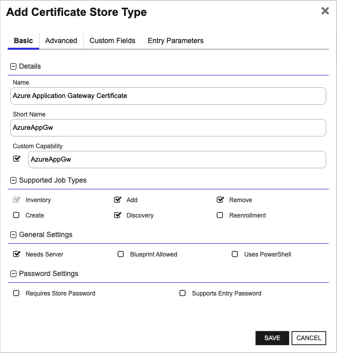
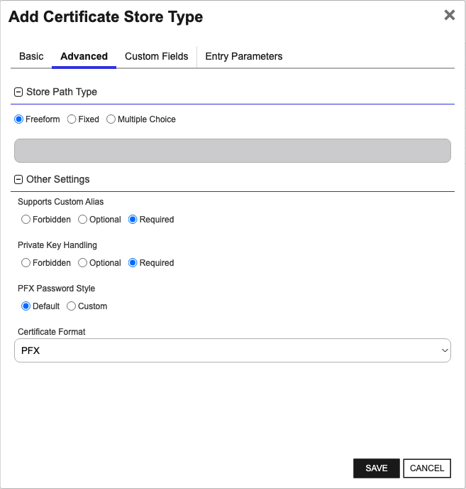

## Azure Application Gateway Certificate

The Azure Application Gateway Certificate store type, `AzureAppGw`, manages `ApplicationGatewaySslCertificate` objects owned by Azure Application Gateways. This store type collects inventory and manages all ApplicationGatewaySslCertificate objects associated with an Application Gateway. The store type is implemented primarily for Inventory and Management Remove operations, since the intended usage of ApplicationGatewaySslCertificates in Application Gateways is for serving TLS client traffic via TLS Listeners. Management Add and associated logic for certificate renewal is also supported for this certificate store type for completeness, but the primary intended functionality of this extension is implemented with the App Gateway Certificate Binding store type.

> If an ApplicationGatewaySslCertificate is bound to a TLS Listener at the time of a Management Remove operation, the operation will fail since at least one certificate must be bound at all times.

> If a renewal job is scheduled for an `AzureAppGw` certificate store, the extension will report a success and perform no action if the certificate being renewed is bound to a TLS Listener. This is because a certificate located in an `AzureAppGw` certificate store that is bound to a TLS Listener is logically the same as the same certificate located in an `AzureAppGwBin` store type. For this reason, it's expected that the certificate will be renewed and re-bound to the listener by the `AppGwBin` certificate operations.
>
> If the renewed certificate is not bound to a TLS Listener, the operation will be performed the same as any certificate renewal process that honors the Overwrite flag.


### Supported Job Types

| Job Name | Supported |
| -------- | --------- |
| Inventory | ✅ |
| Management Add | ✅ |
| Management Remove | ✅ |
| Discovery | ✅ |
| Create |  |
| Reenrollment |  |

## Requirements

#### Azure Service Principal (Azure Resource Manager Authentication)

The Azure Application Gateway Orchestrator extension uses an [Azure Service Principal](https://learn.microsoft.com/en-us/entra/identity-platform/app-objects-and-service-principals?tabs=browser) for authentication. Follow [Microsoft's documentation](https://learn.microsoft.com/en-us/entra/identity-platform/howto-create-service-principal-portal) to create a service principal.

##### Azure Application Gateway permissions

For quick start and non-production environments, a Role Assignment should be created on _each resource group_ that own Application Gateways desiring management that grants the created Application/Service Principal the [Contributor (Privileged administrator) Role](https://learn.microsoft.com/en-us/azure/role-based-access-control/built-in-roles#contributor). For production environments, a custom role should be created that grants the following permissions:

- `Microsoft.Resources/subscriptions/resourcegroups/read` - Read : Get Resource Group
- `Microsoft.Network/applicationGateways/read` - Read : Get Application Gateway
- `Microsoft.Network/applicationGateways/write` - Write : Create or Update Application Gateway
- `Microsoft.ManagedIdentity/userAssignedIdentities/assign/action` - Other : RBAC action for assigning an existing user assigned identity to a resource
- `Microsoft.Network/virtualNetworks/subnets/join/action` - Other : Joins a virtual network. Not Alertable.

> Note that even if the Service Principal has permission to perform the 'Microsoft.Network/applicationGateways/write' action over the scope of the required resource group, there may be other permissions that are required by the CreateOrUpdate operation depending on the complexity of the Application Gateway's configuration. As such, the list of permissions above should not be considered as comprehensive.

##### Azure Key Vault permissions

If the managed Application Gateway is integrated with Azure Key Vault per the discussion in the [Certificates Imported to Application Gateways from Azure Key Vault](#certificates-imported-to-application-gateways-from-azure-key-vault) section, perform one of the following actions for each Key Vault with certificates imported to App Gateways:
* **Azure role-based access control** - Create a Role Assignment that grants the Application/Service Principal the [Key Vault Secrets User](https://learn.microsoft.com/en-us/azure/key-vault/general/rbac-guide?tabs=azure-cli) built-in role.
* **Vault access policy** - [Create an Access Policy](https://learn.microsoft.com/en-us/azure/key-vault/general/assign-access-policy?tabs=azure-portal) that grants the Application/Service Principal the Get secret permission for each Azure Key Vault.

##### Client Certificate or Client Secret

Beginning in version 3.0.0, the Azure Application Gateway Orchestrator extension supports both [client certificate authentication](https://learn.microsoft.com/en-us/graph/auth-register-app-v2#option-1-add-a-certificate) and [client secret](https://learn.microsoft.com/en-us/graph/auth-register-app-v2#option-2-add-a-client-secret) authentication.

* **Client Secret** - Follow [Microsoft's documentation](https://learn.microsoft.com/en-us/graph/auth-register-app-v2#option-2-add-a-client-secret) to create a Client Secret. This secret will be used as the **Server Password** field in the [Certificate Store Configuration](#certificate-store-configuration) section.
* **Client Certificate** - Create a client certificate key pair with the Client Authentication extended key usage. The client certificate will be used in the ClientCertificate field in the [Certificate Store Configuration](#certificate-store-configuration) section. If you have access to Keyfactor Command, the instructions in this section walk you through enrolling a certificate and ensuring that it's in the correct format. Once enrolled, follow [Microsoft's documentation](https://learn.microsoft.com/en-us/graph/auth-register-app-v2#option-1-add-a-certificate) to add the _public key_ certificate (no private key) to the service principal used for authentication.

    The certificate can be in either of the following formats:
    * Base64-encoded PKCS#12 (PFX) with a matching private key.
    * Base64-encoded PEM-encoded certificate _and_ PEM-encoded PKCS8 private key. Make sure that the certificate and private key are separated with a newline. The order doesn't matter - the extension will determine which is which.

    If the private key is encrypted, the encryption password will replace the **Server Password** field in the [Certificate Store Configuration](#certificate-store-configuration) section.

> **Creating and Formatting a Client Certificate using Keyfactor Command**
>
> To get started quickly, you can follow the instructions below to create and properly format a client certificate to authenticate to the Microsoft Graph API.
>
> 1. In Keyfactor Command, hover over **Enrollment** and select **PFX Enrollment**.
> 2. Select a **Template** that supports Client Authentication as an extended key usage.
> 3. Populate the certificate subject as appropriate for the Template. It may be sufficient to only populate the Common Name, but consult your IT policy to ensure that this certificate is compliant.
> 4. At the bottom of the page, uncheck the box for **Include Chain**, and select either **PFX** or **PEM** as the certificate Format.
> 5. Make a note of the password on the next page - it won't be shown again.
> 6. Prepare the certificate and private key for Azure and the Orchestrator extension:
>     * If you downloaded the certificate in PEM format, use the commands below:
>
>        ```shell
>        # Verify that the certificate downloaded from Command contains the certificate and private key. They should be in the same file
>        cat <your_certificate.pem>
>
>        # Separate the certificate from the private key
>        openssl x509 -in <your_certificate.pem> -out pubkeycert.pem
>
>        # Base64 encode the certificate and private key
>        cat <your_certificate.pem> | base64 > clientcertkeypair.pem.base64
>        ```
>
>    * If you downloaded the certificate in PFX format, use the commands below:
>
>        ```shell
>        # Export the certificate from the PFX file
>        openssl pkcs12 -in <your_certificate.pfx> -clcerts -nokeys -out pubkeycert.pem
>
>        # Base64 encode the PFX file
>        cat <your_certificate.pfx> | base64 > clientcert.pfx.base64
>        ```
> 7. Follow [Microsoft's documentation](https://learn.microsoft.com/en-us/graph/auth-register-app-v2#option-1-add-a-certificate) to add the public key certificate to the service principal used for authentication.
>
> You will use `clientcert.[pem|pfx].base64` as the **ClientCertificate** field in the [Certificate Store Configuration](#certificate-store-configuration) section.


## Certificate Store Type Configuration

The recommended method for creating the `AzureAppGw` Certificate Store Type is to use [kfutil](https://github.com/Keyfactor/kfutil). After installing, use the following command to create the `` Certificate Store Type:

```shell
kfutil store-types create AzureAppGw
```

<details><summary>AzureAppGw</summary>

Create a store type called `AzureAppGw` with the attributes in the tables below:

### Basic Tab
| Attribute | Value | Description |
| --------- | ----- | ----- |
| Name | Azure Application Gateway Certificate | Display name for the store type (may be customized) |
| Short Name | AzureAppGw | Short display name for the store type |
| Capability | AzureAppGw | Store type name orchestrator will register with. Check the box to allow entry of value |
| Supported Job Types (check the box for each) | Add, Discovery, Remove | Job types the extension supports |
| Supports Add | ✅ | Check the box. Indicates that the Store Type supports Management Add |
| Supports Remove | ✅ | Check the box. Indicates that the Store Type supports Management Remove |
| Supports Discovery | ✅ | Check the box. Indicates that the Store Type supports Discovery |
| Supports Reenrollment |  |  Indicates that the Store Type supports Reenrollment |
| Supports Create |  |  Indicates that the Store Type supports store creation |
| Needs Server | ✅ | Determines if a target server name is required when creating store |
| Blueprint Allowed |  | Determines if store type may be included in an Orchestrator blueprint |
| Uses PowerShell |  | Determines if underlying implementation is PowerShell |
| Requires Store Password |  | Determines if a store password is required when configuring an individual store. |
| Supports Entry Password |  | Determines if an individual entry within a store can have a password. |

The Basic tab should look like this:



### Advanced Tab
| Attribute | Value | Description |
| --------- | ----- | ----- |
| Supports Custom Alias | Required | Determines if an individual entry within a store can have a custom Alias. |
| Private Key Handling | Required | This determines if Keyfactor can send the private key associated with a certificate to the store. Required because IIS certificates without private keys would be invalid. |
| PFX Password Style | Default | 'Default' - PFX password is randomly generated, 'Custom' - PFX password may be specified when the enrollment job is created (Requires the Allow Custom Password application setting to be enabled.) |

The Advanced tab should look like this:



### Custom Fields Tab
Custom fields operate at the certificate store level and are used to control how the orchestrator connects to the remote target server containing the certificate store to be managed. The following custom fields should be added to the store type:

| Name | Display Name | Type | Default Value/Options | Required | Description |
| ---- | ------------ | ---- | --------------------- | -------- | ----------- |


The Custom Fields tab should look like this:


</details>

## Certificate Store Configuration

After creating the `AzureAppGw` Certificate Store Type and installing the Azure Application Gateway Universal Orchestrator extension, you can create new [Certificate Stores](https://software.keyfactor.com/Core-OnPrem/Current/Content/ReferenceGuide/Certificate%20Stores.htm?Highlight=certificate%20store) to manage certificates in the remote platform.

The following table describes the required and optional fields for the `AzureAppGw` certificate store type.

| Attribute | Description | Attribute is PAM Eligible |
| --------- | ----------- | ------------------------- |
| Category | Select "Azure Application Gateway Certificate" or the customized certificate store name from the previous step. | |
| Container | Optional container to associate certificate store with. | |
| Client Machine | The fully qualified domain name (FQDN) or the IP address of the Azure Application Gateway. Example: myappgateway.example.com | |
| Store Path | The Azure Resource ID of the specific Azure Application Gateway instance where the certificate will be managed. Example: /subscriptions/{subscription-id}/resourceGroups/{resource-group-name}/providers/Microsoft.Network/applicationGateways/{gateway-name} | |
| Orchestrator | Select an approved orchestrator capable of managing `AzureAppGw` certificates. Specifically, one with the `AzureAppGw` capability. | |

* **Using kfutil**

    ```shell
    # Generate a CSV template for the AzureApp certificate store
    kfutil stores import generate-template --store-type-name AzureAppGw --outpath AzureAppGw.csv

    # Open the CSV file and fill in the required fields for each certificate store.

    # Import the CSV file to create the certificate stores
    kfutil stores import csv --store-type-name AzureAppGw --file AzureAppGw.csv
    ```

* **Manually with the Command UI**: In Keyfactor Command, navigate to Certificate Stores from the Locations Menu. Click the Add button to create a new Certificate Store using the attributes in the table above.