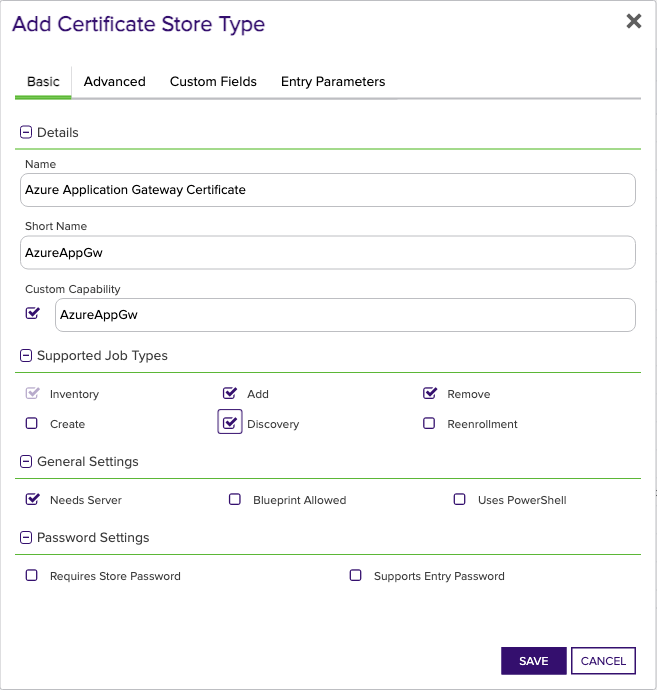
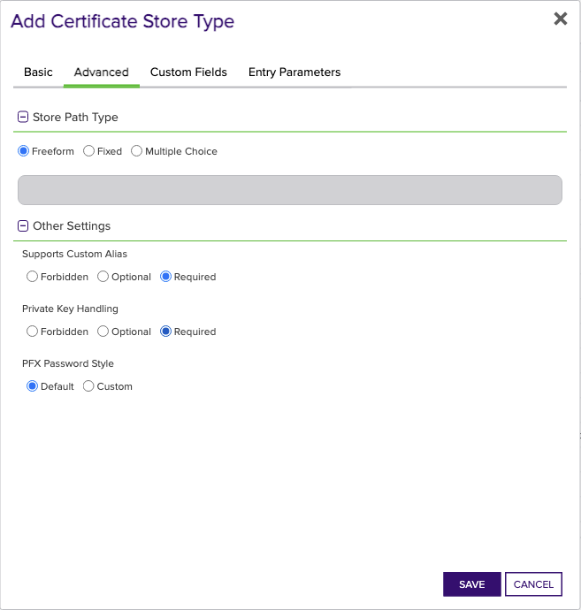
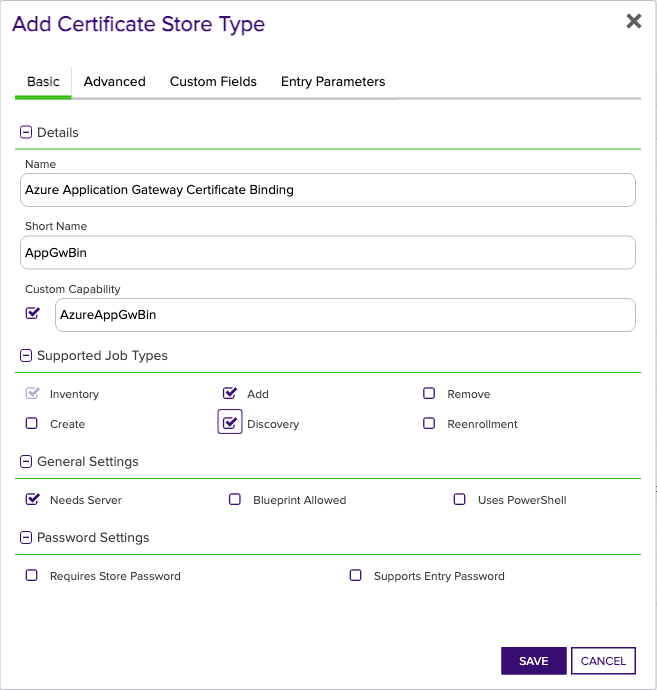
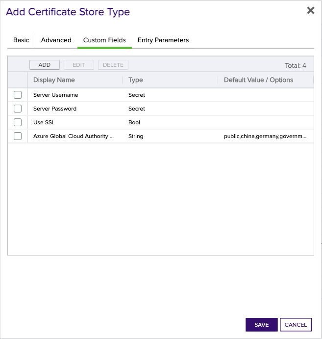

### Azure Application Gateway Certificate store type

The Azure Application Gateway Certificate store type, `AzureAppGw`, manages `ApplicationGatewaySslCertificate` objects owned by Azure Application Gateways. This store type collects inventory and manages all ApplicationGatewaySslCertificate objects associated with an Application Gateway. The store type is implemented primarily for Inventory and Management Remove operations, since the intended usage of ApplicationGatewaySslCertificates in Application Gateways is for serving TLS client traffic via TLS Listeners. Management Add and associated logic for certificate renewal is also supported for this certificate store type for completeness, but the primary intended functionality of this extension is implemented with the App Gateway Certificate Binding store type.

> If an ApplicationGatewaySslCertificate is bound to a TLS Listener at the time of a Management Remove operation, the operation will fail since at least one certificate must be bound at all times.

> If a renewal job is scheduled for an `AzureAppGw` certificate store, the extension will report a success and perform no action if the certificate being renewed is bound to a TLS Listener. This is because a certificate located in an `AzureAppGw` certificate store that is bound to a TLS Listener is logically the same as the same certificate located in an `AzureAppGwBin` store type. For this reason, it's expected that the certificate will be renewed and re-bound to the listener by the `AppGwBin` certificate operations.
>
> If the renewed certificate is not bound to a TLS Listener, the operation will be performed the same as any certificate renewal process that honors the Overwrite flag.

### Azure Application Gateway Certificate Binding store type

The Azure Application Gateway Certificate Binding store type, `AzureAppGwBin`, represents certificates bound to TLS Listeners on Azure App Gateways. The only supported operations on this store type are Management Add and Inventory. The Management Add operation for this store type creates and binds an ApplicationGatewaySslCertificate to a pre-existing TLS Listener on an Application Gateway. When the Add operation is configured in Keyfactor Command, the certificate Alias configures which TLS Listener the certificate will be bound to. If the HTTPS listener is already bound to a certificate with the same name, the Management Add operation will perform a replacement of the certificate, _**regardless of the existence of the Replace flag configured with renewal jobs**_. The replacement operation performs several API interactions with Azure since at least one certificate must be bound to a TLS listener at all times, and the name of ApplicationGatewaySslCertificates must be unique. For the sake of completeness, the following describes the mechanics of this replacement operation:
 
1. Determine the name of the certificate currently bound to the HTTPS listener - Alias in 100% of cases if the certificate was originally added by the App Gateway Orchestrator Extension, or something else if the certificate was added by some other means (IE, the Azure Portal, or some other API client).
2. Create and bind a temporary certificate to the HTTPS listener with the same name as the Alias.
3. Delete the AppGatewayCertificate previously bound to the HTTPS listener called Alias.
4. Recreate and bind an AppGatewayCertificate with the same name as the HTTPS listener called Alias. If the Alias is called `listener1`, the new certificate will be called `listener1`, regardless of the name of the certificate that was previously bound to the listener.
5. Delete the temporary certificate.

In the unlikely event that a failure occurs at any point in the replacement procedure, it's expected that the correct certificate will be served by the TLS Listener, since most of the mechanics are actually implemented to resolve the unique naming requirement. 

The Inventory job type for `AzureAppGwBin` reports only ApplicationGatewaySslCertificates that are bound to TLS Listeners. If the certificate was added with Keyfactor Command and this orchestrator extension, the name of the certificate in the Application Gateway will be the same as the TLS Listener. E.g., if the Alias configured in Command corresponds to a TLS Listener called `location-service-https-lstn1`, the certificate in the Application Gateway will also be called `location-service-https-lstn1`. However, if the certificate was added to the Application Gateway by other means (such as the Azure CLI, import from AKV, etc.), the Inventory job mechanics will still report the name of the TLS Listener in its report back to Command. 

### Discovery Job

Both `AzureAppGw` and `AzureAppGwBin` support the Discovery operation. The Discovery operation discovers all Azure Application Gateways in each resource group that the service principal has access to. The discovered Application Gateways are reported back to Command and can be easily added as certificate stores from the Locations tab.

The Discovery operation uses the "Directories to search" field, and accepts input in one of the following formats:
- `*` - If the asterisk symbol `*` is used, the extension will search for Application Gateways in every resource group that the service principal has access to, but only in the tenant that the discovery job was configured for as specified by the "Client Machine" field in the certificate store configuration.
- `<tenant-id>,<tenant-id>,...` - If a comma-separated list of tenant IDs is used, the extension will search for Application Gateways in every resource group and tenant specified in the list. The tenant IDs should be the GUIDs associated with each tenant, and it's the user's responsibility to ensure that the service principal has access to the specified tenants.

### Manually Adding Certificate Stores
The recommended and supported way to create Certificate Store Types in Command is to use [kfutil](https:/../.github.com/Keyfactor/kfutil). However, if you prefer to create store types manually in the UI, navigate to your Command instance and follow the instructions below.

AzureAppGw

Create a store type called `AzureAppGw` with the attributes in the tables below:

### Basic Tab
| Attribute | Value | Description |
| --------- | ----- | ----- |
| Name | Azure Application Gateway Certificate | Display name for the store type (may be customized) |
| Short Name | AzureAppGw | Short display name for the store type |
| Capability | AzureAppGw | Store type name orchestrator will register with. Check the box to allow entry of value |
| Supported Job Types (check the box for each) | Add, Remove, Discovery, Inventory | Job types the extension supports |
| Needs Server | &check; | Determines if a target server name is required when creating store |
| Blueprint Allowed |  | Determines if store type may be included in an Orchestrator blueprint |
| Uses PowerShell |  | Determines if underlying implementation is PowerShell |
| Requires Store Password |  | Determines if a store password is required when configuring an individual store. |
| Supports Entry Password |  | Determines if an individual entry within a store can have a password. |

The Basic tab should look like this:

### Advanced Tab
| Attribute | Value | Description |
| --------- | ----- | ----- |
| Supports Custom Alias | Required | Determines if an individual entry within a store can have a custom Alias. |
| Private Key Handling | Required | This determines if Keyfactor can send the private key associated with a certificate to the store. Required because IIS certificates without private keys would be invalid. |
| PFX Password Style | Default | 'Default' - PFX password is randomly generated, 'Custom' - PFX password may be specified when the enrollment job is created (Requires the Allow Custom Password application setting to be enabled.) |

The Advanced tab should look like this:

### Custom Fields Tab
Custom fields operate at the certificate store level and are used to control how the orchestrator connects to the remote target server containing the certificate store to be managed. The following custom fields should be added to the store type:

| Name | Display Name | Type | Default Value/Options | Required | Description |
| ---- | ------------ | ---- | --------------------- | -------- | ----------- |
| ServerUsername | Server Username | Secret | None | &check; | Application ID of the service principal, representing the identity used for managing the Application Gateway. |
| ServerPassword | Server Password | Secret | None | &check; | Secret of the service principal that will be used to manage the Application Gateway. |
| ServerUseSsl | Use SSL | Bool | true |  | Indicates whether SSL usage is enabled for the connection. |
| AzureCloud | Azure Global Cloud Authority Host | MultipleChoice | public,china,germany,government |  | Specifies the Azure Cloud instance used by the organization. |

The Custom Fields tab should look like this:

AppGwBin

Create a store type called `AppGwBin` with the attributes in the tables below:

### Basic Tab
| Attribute | Value | Description |
| --------- | ----- | ----- |
| Name | Azure Application Gateway Certificate Binding | Display name for the store type (may be customized) |
| Short Name | AppGwBin | Short display name for the store type |
| Capability | AzureAppGwBin | Store type name orchestrator will register with. Check the box to allow entry of value |
| Supported Job Types (check the box for each) | Add, Discovery | Job types the extension supports |
| Needs Server | &check; | Determines if a target server name is required when creating store |
| Blueprint Allowed |  | Determines if store type may be included in an Orchestrator blueprint |
| Uses PowerShell |  | Determines if underlying implementation is PowerShell |
| Requires Store Password |  | Determines if a store password is required when configuring an individual store. |
| Supports Entry Password |  | Determines if an individual entry within a store can have a password. |

The Basic tab should look like this:

### Advanced Tab
| Attribute | Value | Description |
| --------- | ----- | ----- |
| Supports Custom Alias | Required | Determines if an individual entry within a store can have a custom Alias. |
| Private Key Handling | Required | This determines if Keyfactor can send the private key associated with a certificate to the store. Required because IIS certificates without private keys would be invalid. |
| PFX Password Style | Default | 'Default' - PFX password is randomly generated, 'Custom' - PFX password may be specified when the enrollment job is created (Requires the Allow Custom Password application setting to be enabled.) |

The Advanced tab should look like this:

### Custom Fields Tab
Custom fields operate at the certificate store level and are used to control how the orchestrator connects to the remote target server containing the certificate store to be managed. The following custom fields should be added to the store type:

| Name | Display Name | Type | Default Value/Options | Required | Description |
| ---- | ------------ | ---- | --------------------- | -------- | ----------- |
| ServerUsername | Server Username | Secret | None |  | Application ID of the service principal, representing the identity used for managing the Application Gateway. |
| ServerPassword | Server Password | Secret | None |  | Secret of the service principal that will be used to manage the Application Gateway. |
| ServerUseSsl | Use SSL | Bool | true | &check; | Indicates whether SSL usage is enabled for the connection. |
| AzureCloud | Azure Global Cloud Authority Host | MultipleChoice | public,china,germany,government |  | Specifies the Azure Cloud instance used by the organization. |

The Custom Fields tab should look like this:

